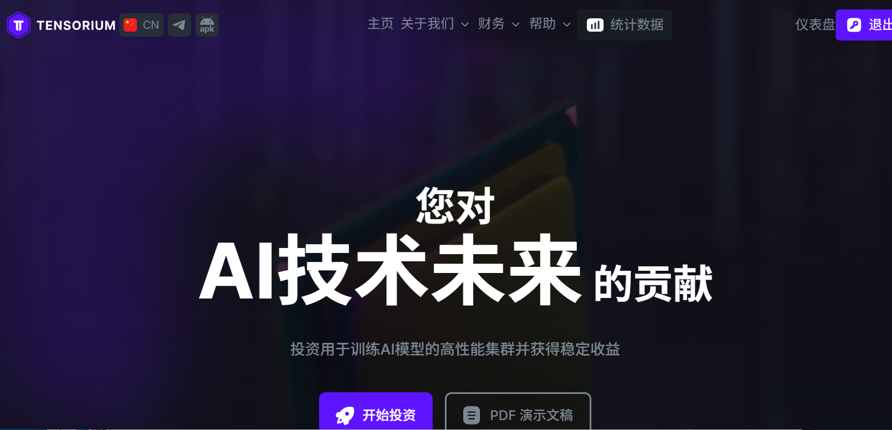
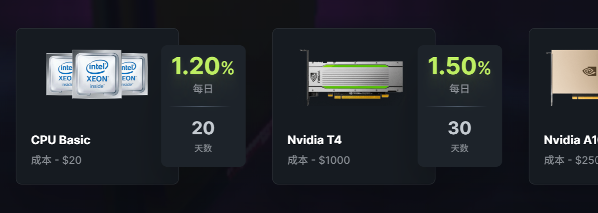

:::tip

### 开始日期：2025年2月17日
计划: 每日 1.2% 共 20 天（押金返还
最低存款: 20美元 
最低支出: 1.00 USDT/USDC BEP20、50.00 USDT TRC20、0.015 ETH、0.01 LTC、0.05 SOL、0.001 BTC、0.005 BNB、20.00 TRX 
付款类型: 立即的    
支付系统: Bitcoin, Ethereum, Litecoin, Tether, Tron, Binance Coin

[®️立即访问](https://tensorium.ai/?aff=ten549955)
:::

### 关于
Tensorium 的核心使命是让所有致力于推动人工智能革命性技术发展的人都能享受高性能计算资源，从而加速人工智能的进步。我们相信，人工智能有潜力彻底改变我们的社会，改善全球人民的生活，涵盖医疗保健、教育等领域。我们的目标是为开发者、科学家和企业家提供探索、创建和扩展下一代人工智能解决方案所需的工具，从而支持和促进创新。

### [®️立即访问](https://tensorium.ai/?aff=ten549955)

