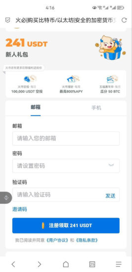
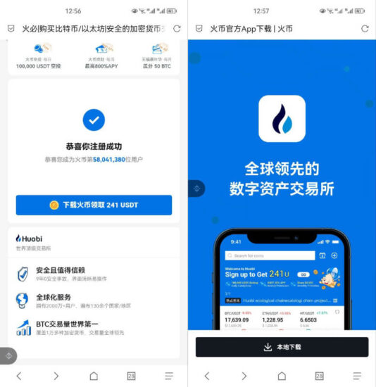
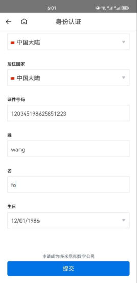

## 火币注册流程

1. 打开注册链接:[点击我](https://www.htx.com.se/invite/zh-cn/1f?invite_code=8kzg9223)
2. 输入邮箱/手机号和密码，然后点击【发送】获取验证码；
3. 填写收到的验证码后，点击【注册领取241USDT】即可完成账户注册。

### 就这么简单的我们就创建了一个用来交易数字货币的交易所账户了。

## 下载和安装App
在注册完账户后，网页会自动跳转到火币App下载界面，如下图所示。

### 安卓手机：
直接下载安装即可，如遇提示风险，直接无视即可，华为手机需关闭纯净模式。

### 苹果手机：

需要使用非大陆苹果ID才能安装。在点击【下载火币领取241USDT】后的下载页面会有提示，此时点击App Store后会跳转一个火币官方给的获取海外苹果ID的教程，页面上还有官方客服的联系方式。

不会注册海外Apple ID的用户可以联系官方客服获取帮助。

## 身份认证
在安装火币App后，使用注册的账户密码登录火币交易所App，接下来就要进行身份认证。

如果不进行身份认证，将无法进行法币交易，并且会有交易和提币的限额，所以虽然身份认证不是必须的，但还是建议完成身份认证。

* 上传中国大陆身份证可完成L2、L3认证；
* L1认证时姓名请用拼音（如：王佛，姓填：Wang，名填：Fo）；
* 法币交易需要身份认证L3高级认证。

## 安全设置
绑定谷歌身份验证器，这一步不在赘述，苹果手机可以在应用商城搜索“Google Authentication”安装，安卓手机可以参考《币安绑定身份验证器详细步骤》。

